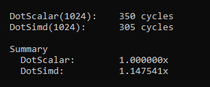

# How to NOT use SIMD

[I see questions like this all the time](https://stackoverflow.com/questions/4120681/how-to-calculate-single-vector-dot-product-using-sse-intrinsic-functions-in-c) – how to SIMDize a Vector Dot Product. I also see this kind of code in productions of massive codebases where performance is critical. As proof, here is the VectorDot4 function in [Unreal Engine](https://github.com/EpicGames/UnrealEngine/blob/5.3.2-release/Engine/Source/Runtime/Core/Public/Math/UnrealMathSSE.h), which calculates a single dot product from two vectors:


But what’s so wrong about this? Surely SIMD should give us some performance benefits compared to scalar code. Well let’s test that theory out, here is a simple benchmark running this VectorDot4 on 1024 pairs of random vectors. *The vectors are laid out contiguous and memory access is linear in a tight loop. The cache has also been warmed up.*



Okay we get a little bit of performance gains but this still doesn’t sit right with me. Think about it, SIMD is supposed to be processing multiple pieces of data for roughly (usually) the same cost as doing a scalar operation. The fact that we are getting such minor wins to me says that we are doing something wrong. What I expect is that we should get a whole 4x speedup, not a 1.15x speedup. This is also way harder to write and understand compared to just a normal dot product.

Let’s break down what the VectorDot4 actually does. But first, a quick primer on how SIMD works. SIMD allows us to operate on multiple pieces of data with a single instruction (Single Instruction Multiple Data). On modern hardware, the latency and throughput of packed (SIMD) instructions is roughly the same as that of the equivalent scalar instruction ([but you should always verify that](https://www.agner.org/optimize/instruction_tables.pdf)). SIMD Works in a “vertical” manner, let me illustrate:


We have two arrays of 4 elements A & B, when we add these with SIMD it adds each element in the same **lane** to produce a new array C. This is what I mean with SIMD works vertically. In general there are no horizontal instructions, meaning you can’t really operate across different lanes.

Now let’s go back to our VectorDot4 example. The input SIMD lanes in Vec1 and Vec2 are laid out like this, your typical vector:


First we multiply Vec1 and Vec2 to calculate the Square for each component in the vector. The next step is to sum all the components together. Here is the ‘Oh Shit’ moment — we need to operate horizontally across lanes to sum each component. We have a bunch of options here;


1. Switch to scalar operations. We multiply as SIMD but then add like we would normally:
```c
R = _mm_mul_ps(Vec1, Vec2); // packed mul
return R[0] + R[1] + R[2] + R[3]; // 3x scalar adds
```

2. The other approach, which is what VectorDot4 does is to use Shuffles. A shuffle simply reorganizes the lanes. The idea is to shuffle the lanes so that they line up, then add them together vertically.


Now the X and Y components are aligned to the same lane and we can multiply them. Then we need to do another shuffle and add again for the Z component.


Neither of these two options are ideal, but at least with the second one we don’t have to switch to scalar. But the key point is that those shuffles are not free, it’s an instruction that has to be executed. These offset the gains that we get from using SIMD instructions in the multiplication — which is why we get such a tiny speedup.

## Using SIMD correctly
The whole point of SIMD is to process multiple things at the same time — so let’s just do that instead. **We should be processing four individual dot products at once, not just a single one.** Let’s update our VectorDot4 function


You’ll notice that we’ve split up Vec1 and Vec2 into its separate components. This is important as we see here


Look at how clean that is, no need to shuffle. It follows the DotProduct formula exactly with 3x Muls and 2x Adds. This is also significantly easier to understand and debug. But what about performance?


A near perfect 4x speed up. This is what we should expect from SIMD. On my Zen2 CPU the latency & throughput of packed and scalar float multiplication/ additions are exactly the same. Meaning that we should be able to process 4x the data at exactly the same speeds. And we see that here.

One thing that I haven’t mentioned up until this point is that a 4 wide SIMD is the **minimum** on x64 CPUs. Nearly all modern processors ship with the AVX instruction set which allows us to operate on **8-wide** (256-bit) lanes. In the original VectorDot4 it would be impossible or very wasteful to scale up to 8 wide since a vector only contains 3 components. But when processing individual dot products we can very easily scale up:


## Wrapping Up
Unfortunately I think a lot of the issue as to why SIMD is being misused is due to poor data layout. As we saw, in order to calculate four individual dot products we need to separate out each component in the vector. This is unintuitive to most programmers and most systems are not designed to be flexible enough to support both types of data layouts. This is why it’s important to always keep performance and SIMD in mind early when designing a system. You don’t have to optimize your code now, but make sure that the code is **optimizable**. 

It is also okay to keep multiple copies of the same data but stored in different formats. Then select one depending on what makes sense for the routine which you are about to run. RAM is cheap nowadays but it’s the bandwidth that’s at premium. Another approach would be to swizzle your data layout before sending it to the SIMD routine and then swizzle it back to the original format once done. But don’t be brainless when doing this; make sure that wins gained from the SIMD routine outweighs the overhead of memory moves when swizzling. There are many different approaches to this so it’s important that the layout is flexible.

Another thing to mention is to be very careful of branches, and usually, avoid them completely. The cost of mispredicting a branch on modern hardware is in the order of 10-20 cycles (depends on your microarchitecture). You should avoid branches where the condition changes per iteration at all costs. Calculating both values and then selecting based on the condition is a typical way of avoiding branches with SIMD. There are many ways of doing this, here is one example
```c
__m128 cond = _mm_set1_epi32(/*true*/0xffffffff, /*false*/0x00000000, /*true*/0xffffffff, /*false*/0x00000000);
__m128 a = _mm_blendv_ps(someConst1, someConst2, cond);
...
```


But anyways, I have gone on for long enough now so hopefully you learned something or gained a different perspective on SIMD
~ Dennis
